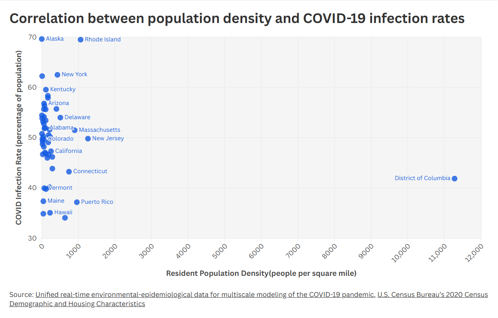
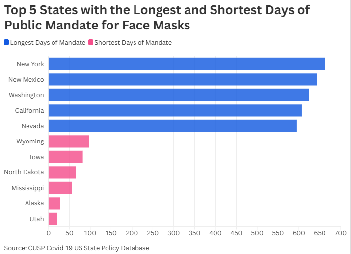
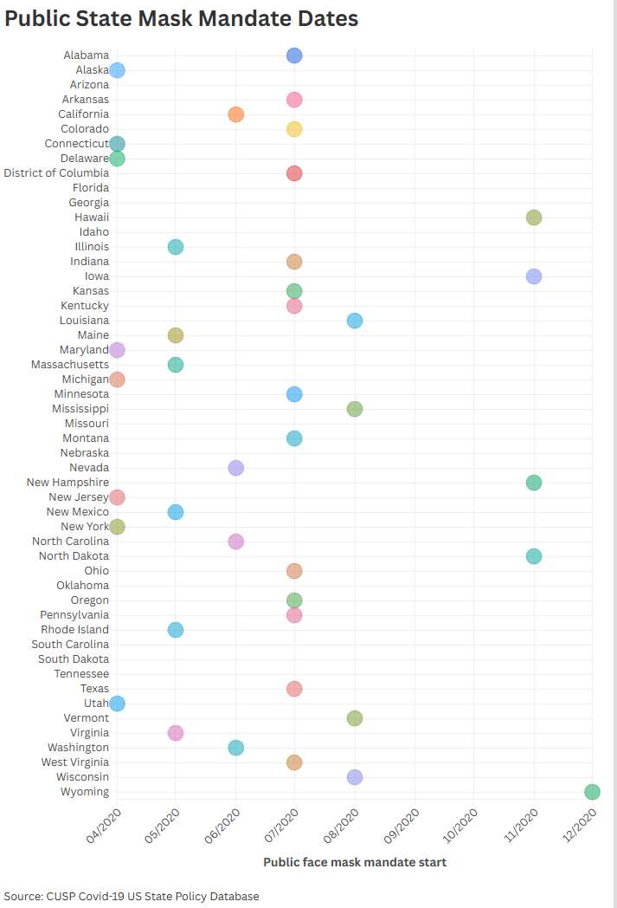
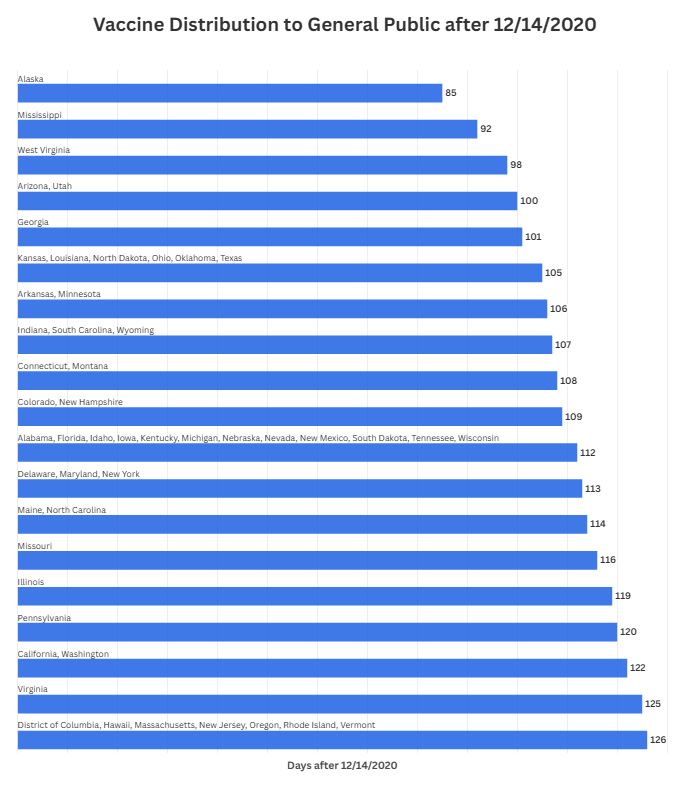
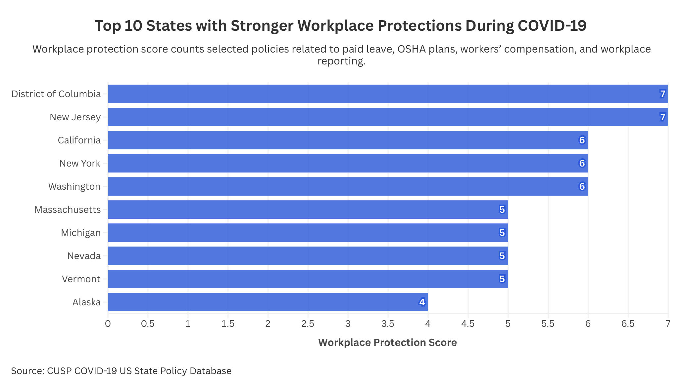

# Project 2 Data Narrative (Dylan Lim, Raghu Ramamurthy, Andy Hernandez-Gomez, Kim Liao)

The COVID-19 pandemic exposed significant differences in how U.S. states responded to public health emergencies. While some states implemented strict workplace protections, mask mandates, and long-term safety regulations, others adopted fewer restrictions or had timed their regulations in a different way. Our analysis explores how many policy decisions may have influenced COVID-19 infection rates across states.

## Datasets
[Badr, H.S., Zaitchik, B.F., Kerr, G.H. et al. Unified real-time environmental-epidemiological data for multiscale modeling of the COVID-19 pandemic. Sci Data 10, 367 (2023). https://doi.org/10.1038/s41597-023-02276-y](https://doi.org/10.1038/s41597-023-02276-y)

[Esri. Population Density in the U.S. (2020 Census). ArcGIS Online. https://www.arcgis.com/home/item.html?id=a1926cb43e844c3f82275917d6eab47a](https://www.arcgis.com/home/item.html?id=a1926cb43e844c3f82275917d6eab47a)

[“CUSP: Data Library.” CUSP: Data Library. https://statepolicies.com/.](https://statepolicies.com/)

## Visualizations

Full project is in the index.html file.